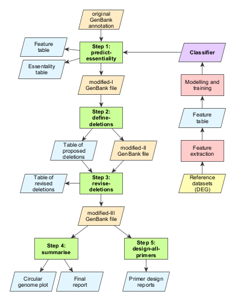

# DELEAT v0.1 (deletion design by essentiality analysis tool)
DELEAT is a bioinformatic analysis pipeline for the design of large-scale genome deletions in bacterial genomes.

It uses a machine learning logistic regression classifier trained on a selection of organisms from the Database of Essential Genes (DEG) to assign an essentiality score for each gene in the genome, and then uses this information to determine non-essential regions.

Once deletions are designed, DELEAT provides the user with useful information in the shape of reports and a circular genome plot to visualise the potential genome reduction.

## Installation

1. Clone the repository: `git clone https://github.com/jime-sg/deleat.git deleat && cd deleat`.
2. Create a Conda env from deleat_env.txt file: `conda env create --name deleat-v0.1 --file deleat_env.txt`. This will install all dependencies.
3. Add DELEAT to your PATH: edit ~/.bashrc file to include `alias deleat="python /your/path/to/deleat/deleat-v0.1/deleat.py"` (change `/your/path/to/` to the appropiate path).

## Usage
First, activate the Conda env: `conda activate deleat-v0.1`

General usage: `deleat <step name> <step arguments>`

Steps (use `deleat <step name> -h` to see command-line usage for each step):

  1. predict-essentiality
  2. define-deletions
  3. revise-deletions
  4. summarise
  5. design-all-primers / design-primers
  

  
### Step 1: predict-essentiality

Get predicted essentiality scores for all genes in a bacterial genome.

Usage: `deleat predict-essentiality -g <GenBank file> -o <output dir> [-p1 <ori>] [-p2 <ter>] -n <n_threads>`

You only need to provide the GenBank annotation file of your organism of interest as input data. Essentiality scores will be calculated for all genes annotated with a unique *locus_tag* identifier. If you know the *ori* and *ter* replication coordinates, you should indicate those as well -- otherwise they will be inferred by the GC skew method.

Results are saved to a *modified-I GenBank file* (`.gbm1`), which includes essentiality scores. This file can be visualised with genome browsing tools such as Artemis, and scores can be edited manually if necessary.

### Step 2: define-deletions

Compute table of proposed deletions.

Usage: `deleat define-deletions -g1 <modified-I GenBank file> -o <output dir> -l <min deletion length> -e <essentiality score threshold>`

An essentiality threshold of about 0.75 is recommended, but feel free to adjust it for your specific case.

Results are saved to a *modified-II GenBank file* (`.gbm2`), which includes essentiality scores and proposed deletions, and a deletion table in CSV format.

### Step 3: revise-deletions

Redefine deletion list after manual curation.

Usage: `deleat revise-deletions -g2 <modified-II GenBank file> -t <modified table of proposed deletions> -o <output dir>`

Edit the output table of step 2 as you need to in order to manually curate the list of deletions. You can eliminate a deletion by either deleting or commenting (#) the corresponding line. Step 3 takes the first three columns (deletion name and coordinates) as input and updates output files accordingly.

### Step 4: summarise

Generate final reports about deletion design and genome reduction process.

Usage: `deleat summarise -g3 <modified-II GenBank file> -o <output dir> [-p1 <ori>] [-p2 <ter>]`

### Step 5: design-all-primers / design-primers

Design primers for large genome deletions by megapriming.

Usage:
  - `deleat design-all-primers -g3 <modified-II GenBank file> -o <output dir> -e <restriction enzyme> [-L <min length for homologous recombination>]`
  
  - `deleat design-primers -g <genome sequence (FASTA)> -o <output dir> -n <deletion name> -d1 <del start> -d2 <del end> -e <restriction enzyme> [-L <min length for homologous recombination>]`

